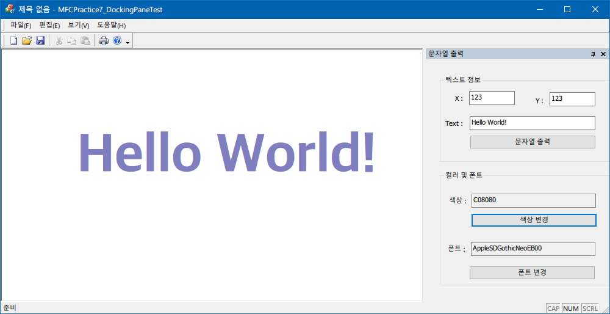

# Docking Pane Test Program
A Program to practice and test Docking Pane Windows

# Watch Program
[2020-11-11] Watch Program with MFC Programming (C++)

### 프로그램 개발 환경
- Language : C++
- OS : Microsoft Windows 10
- IDE : Microsoft Visual Studio 2019 16.4

### 기능 설명
- 도킹 팬 윈도우를 연습하기 위해 만든 프로그램
- *폰트 색상* 및 *글꼴* 을 설정하여 원하는 위치에 글자를 출력하는 프로그램
  - 공용 대화상자를 이용하여 구현

### 실행 화면

